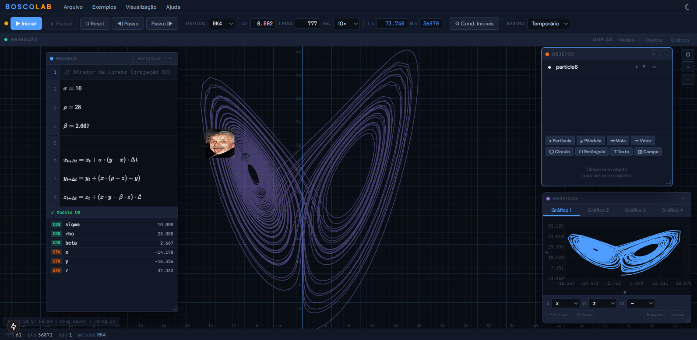

# BOSCOLAB

**Interactive Computational Physics Simulator**

BOSCOLAB is a browser-based physics simulation environment designed for students, educators, and researchers. It allows users to define dynamic systems through differential and iterative equations, visualize motion in real time, and analyze results through interactive graphs — all without installing any software.

- Live: [boscolab-physics.vercel.app](https://boscolab-physics.vercel.app)
- Blog Post: [carauma.com/en/simulador-de-fisica-tipo-modellus](https://www.carauma.com/en/simulador-de-fisica-tipo-modellus)



---

## Features

- **Equation editor** with LaTeX rendering via MathLive
- **Numerical integration** — Euler and Runge-Kutta 4 (RK4) methods
- **Real-time animation canvas** with zoom, pan, and drag support
- **Object system** — particles, pendulums, springs, vectors, circles, rectangles, labels, and vector fields; each property configurable as a constant or a model variable
- **Up to 4 simultaneous graphs** with per-series color coding, PNG and CSV export
- **20+ built-in examples** across mechanics, oscillations, electromagnetism, and complex systems
- **File save/load** via `.modx` format (XML)
- **Dark and light themes**
- **Multiple languages** (on progress)
- **Keyboard shortcuts** for simulation control

---

## Built With

- [Next.js 15](https://nextjs.org/) — React framework
- [MathLive](https://cortexjs.io/mathlive/) — mathematical input

---

## Getting Started
```bash
git clone https://github.com/jancarauma/boscolab-simulation.git
cd boscolab
npm install
npm run dev
```

Open [http://localhost:3000](http://localhost:3000) in your browser.

### Deploy
```bash
npm run build
```

Deployable to [Vercel](https://vercel.com/) with zero configuration.

---

## Examples Included

| Area | Examples |
|---|---|
| Kinematics | Projectile motion, projectile with drag |
| Gravitation | Free fall, Moon vs Earth, Kepler's law, 3-body problem, solar system |
| Oscillations | Simple pendulum, double pendulum, harmonic oscillator, damped oscillator, forced oscillator, Van der Pol |
| Waves | Beats, 2D spring |
| Electromagnetism | RC circuit, electric charges, vector field |
| Complex systems | Lotka-Volterra, Lorenz attractor |

--- 

## 🟠 Contributing

BOSCOLAB is actively developed and currently in use at the **Federal University of Roraima (UFRR)**, in the northern Amazon region of Brazil.

Contributions, ideas, criticism, and suggestions are very welcome — whether you are a student, educator, physicist, or developer. Feel free to open an issue or start a discussion on GitHub. Every bit of feedback helps shape a better tool for education.

---

## License

This project is licensed under the **Creative Commons Attribution-NonCommercial 4.0 International (CC BY-NC 4.0)**.

You are free to use, modify, and share this work for non-commercial and educational purposes, provided appropriate credit is given. Commercial use is not permitted.

[View license →](https://creativecommons.org/licenses/by-nc/4.0/)

---

## Author

© 2026 J. Caraumã | Blog [carauma.com](https://carauma.com)

Developed as an educational tool for computational physics.
